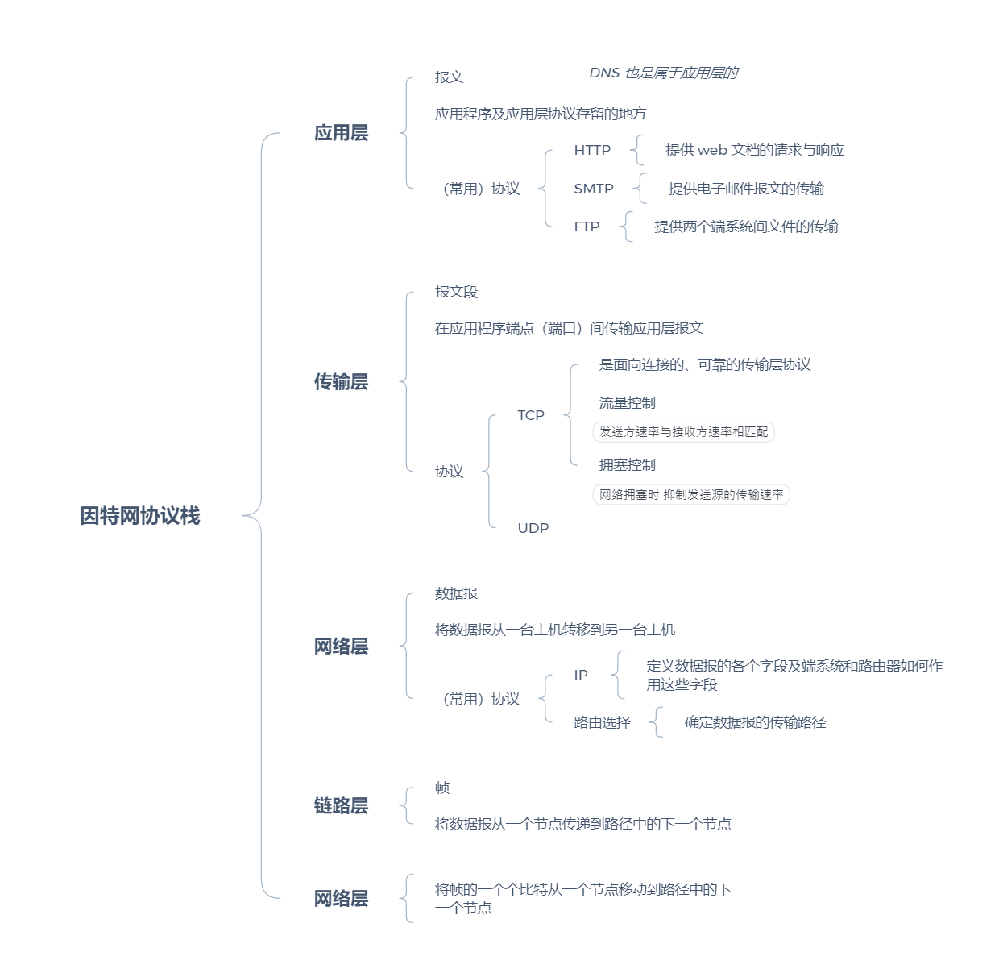

[TOC]

## 1. 计算机网络和因特网

### (1). 网络协议的概念

*对应《计算机网络：自顶向下方法》的 1.1.3（P5）*

协议就是两个或多个通信主体在进行 “谈话交流”。

说的书面些：

> 协议定义了两个或多个通信实体交换的报文的格式和顺序，以及在发送报文、接收报文或对其他事件采取的动作。

举两个例子：

（1）.你通过了初试，去参加复试中的面试。

面试官开始问你问题（面试官向你发出一个报文，该报文被你接受到了），你听见了面试官的问题并迅速地在脑中组织答案，然后回答问题（向面试官发送响应报文）；面试官根据你的回答，判断下一步进行的动作（面试官根据你的响应作出回答，并再次发出报文），你根据面试官的动作，进行适当的回复（你接受到面试官发出的报文，并再次做出响应）。。。。。

（2）.在 web 浏览器中输入了一个网站的 URL。

web 浏览器作为请求方的通信主体向该网站所在的服务器发送请求，服务器根据相应的请求，做出回应。

### (2). 无连接和面向连接服务的概念和区别

### (3). 电路交换和分组交换的概念和区别

*对应《计算机网络：自顶向下方法》的 1.3.1（P15）和 1.3.2（P19）*

### (4). 网络延时的概念和计算方法 

### (5). 计算机网络的体系结构及各层交互的封装过程 

网络设计者以分层的方式设计协议与实现协议的硬件与软件（一个协议层结合硬件与软件来实现）。

#### 1. 为什么要分层呢？

将一个庞大复杂的体系结构分层，就可以定义并讨论它的特定部分，这种模块化思想的本身就是具有很高的价值，并且这也让某层提供的服务实现易于改变，而对整个系统不会产生较大的影响。只要该层对上仍提供相同的服务，对下仍利用相同的服务，当该层服务的实现发生变化时，系统的其他部分仍可保持不变。

#### 2. 计算机网络分层的体系结构有哪些缺点呢？

1. 每层可以会冗余底层的功能。比如数据的校验，应用层、传输层、链路层都有不同程度的实现

#### 3. 计算机网络的两种分层模型：

* 因特网协议栈
* OSI 参考模型

其中较为重要的是因特网协议栈，它将计算机网络划分为五层：应用层、传输层、网络层、链路层、物理层，每层都有自己的协议及实现协议相关的软硬件。而 OSI 参考模型多出了表示层（使应用程序理解用来交换的数据的含义）与会话层（提供数据交换的定界）。因特网协议栈把这两层交给了应用程序的开发者实现。

#### 4. 封装

一个分组成功传输的路径：

数据从发送端系统的协议栈向下，沿着中间分组交换机的协议栈上上下下，然后向上到达接收端的协议栈。

为了区分分组，在分组经过不同层时都会被添加该层的首部，这一过程称为封装。

* 报文到运输层会被添加运输层的首部信息（接收端运输层向上向适当的应用程序传输报文；差错检验检测位），一同构成”报文段“
* 报文段到网络层会被添加网络层的首部信息，一同构成“数据报”
* 数据包到链路层会被添加链路层的首部信息，一同构成“帧”

## 2、应用层 

### (1). 应用层协议的原理 

开发网络应用程序的核心是：写出在能在不同的端系统运行和通过计算机网络通信的程序。

#### 1. 网络应用程序的结构

* 客户 —— 服务器结构
* P2P 结构

#### 2. 进程通信

（进程就是一个应用程序在一个数据集上的一次运行过程。）

网络应用程序由成对的进程组成，这些进程间相互发送报文——发起通信的进程称为客户，在会话开始并等待联系的进程称为服务器。

**套接字**

* 通信的进程通过 套接字 这个软件接口向网络发送报文或从网络接受报文。
* 套接字是同一台主机上应用层和传输层的接口。

报文能够根据 IP 地址送达目的主机。目的主机上有多个可连接网络进行通信的进程。

我们就用端口号区分这些进程。

#### 3. 运输层协议传输报文的要求

* 数据传输可靠

  将一端发送的数据正确、完整地交付给另一端.

* 吞吐量

  可用吞吐量就是发送进程向接收进程交付比特的速率。

  运输层协议要能够以某种特定的速率提供确保的吞吐量。

* 定时

  比如某些交互游戏对交互时间是有要求的 —— 发送方注入套接字的每个比特字到达接收方的套接字不少于 100 ms

  运输层协议应该满足这个要求

* 安全

  数据加密、数据完整性检验、端点鉴别

#### 4. 因特网提供的运输服务

运输层有两个协议:

* TCP

  它提供面向连接 (在发送进程通过套接字传递报文前, 发送进程与接受进程先建立一个 TCP 连接) 、可靠数据传输  (TCP 保证数据无差错、按适当顺序交付所有数据)  的服务

  *SSL 是对 TCP 的一种加强,  并且这种加强还是在应用层实现的*

* UDP

  它提供最小化的传输服务

现有的协议没有实现吞吐量和定时的要求.

### (2). 应用层协议的实现过程 

### (3). Web 应用和 HTTP 协议 

### (4). FTP 协议的实现机制 

### (5). DNS 的功能和实现方法 

### (6). 电子邮件系统的构成、传输机制和协议 

### (7). TCP 和 UDP 套接字编程 

### (8). P2P 文件共享原理 

3、传输层 

（1） TCP 和 UDP 提供的服务及其区别 

（2） 校验和的计算方法 

（3） TCP 的连接控制 

（4） 可靠数据传输原理 

（5） 流量控制原理

 （6） 拥塞控制原理

 （7） TCP 的可靠传输、流量控制和拥塞控制的具体实现方法

 4、网络层 

（1） 虚电路网络和数据报网络的原理 

（2） 路由器的工作原理

 （3） IP 协议及 IP 地址的有关内容 

（4） 因特网的选路算法及其原理 

（5） 理解因特网中的重要选路协议：RIP，OSPF，BGP 

5、链路层和局域网 

（1） 差错检测技术 

（2） 以太网的基本原理及技术

 （3） 网络互连设备：集线器和交换机的原理和技术

 （4） ARP 协议的原理

 6、无线网络与移动网络

 （1） 无线链路和无线网络的特点

 （2） 802.11 无线局域网：802.11 的体系结构、MAC 协议，以及在同一个 IP 子网中的移动过程

 （3） 无线个域网的基本概念：蓝牙和 Zigbee 技术 

（4） 蜂窝因特网的体系结构：3G

 （5） 移动管理的原理：寻址和路由选择到移动结点 

7、多媒体网络

 （1） 多媒体网络的应用 

（2） 内容分发网络（CDN）的基本原理：CDN 在 YouTuBe、Netflix 中的应用

 （3） 综合服务和区分服务

 8、计算机网络中的安全

 （1） 网络安全的概念 

（2） 密码学的基本原则

 （3） 消息完整性和数字签名的概念 

（4） SSL、IPsec、VPN 的基本概念 

（5） 秘钥分发和认证的过程

 （6） 入侵检测的概念