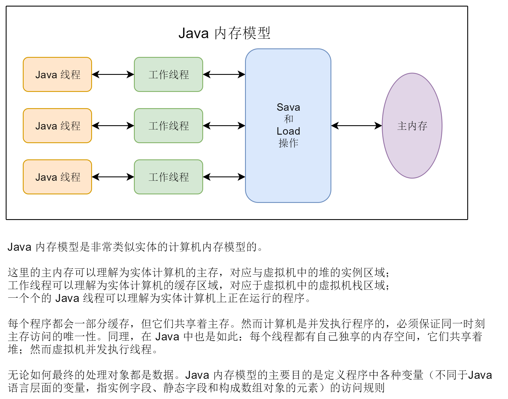
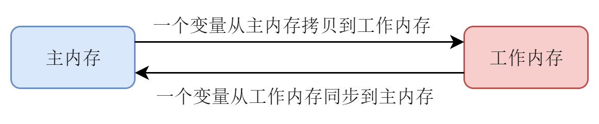
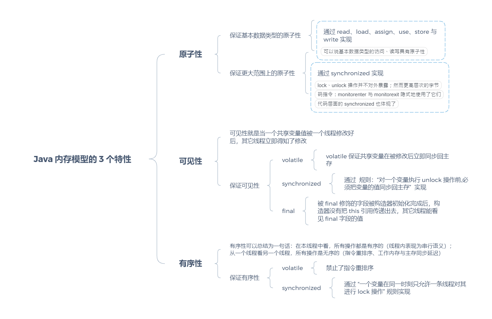
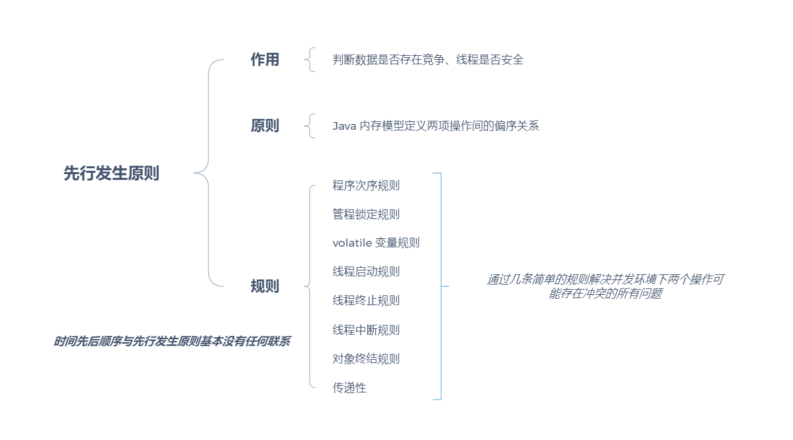
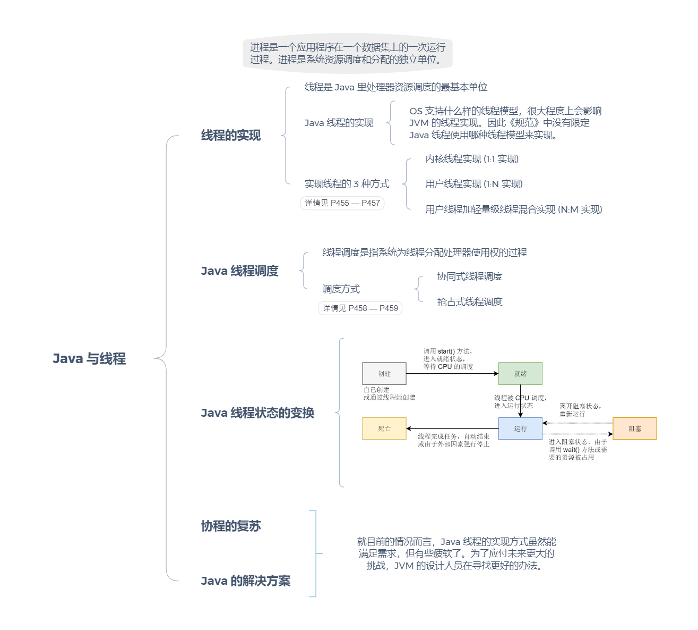

[TOC]

# 第12章 Java内存模型与线程

## 12.1 概述（P438）

## 12.2 硬件的效率与一致性（P439）

> （与处理器的乱序执行优化类似，）Java 虚拟机的即时编译器也有指令重排序的优化。

## 12.3 Java内存模型（P440）

### 12.3.1 主内存与工作内存（P441）



### 12.3.2 内存间的交互操作（P442）



Java 内存模型为了实现这样的交互定义了 8 种操作来实现：

* `lock` ：作用于主内存变量。它把一个变量标识为一个线程独占的状态
* `unlock` ：作用于主内存变量。它释放一个被锁定的变量（释放后的变量才能被其它线程锁定）
* `read` ：作用于主内存变量。它把一个变量的值从主内存拷贝到工作内存，供 `load` 操作使用
* `load` ：作用于工作内存变量。它把 `read` 操作得来的值放到工作内存的副本中
* `use` ：作用于工作内存变量。它把工作内存中变量的值传递给执行引擎（虚拟机遇到使用变量值的字节码指令时会执行该操作）
* `assign` ：作用于工作内存变量。它把从执行引擎接收到的值赋给工作内存中的变量
* `store` ：作用于工作内存变量。它把工作内存中变量的值传递给主内存，供 `write` 操作使用
* `write` ：作用于主内存变量。它把从 `store` 操作中得到的值写入主内存中的变量

*注意：*

* 一个变量从主内存拷贝到工作内存时，<span style="color:red">必须</span> 按顺序执行 `read` 和 `load` 操作（中间可以有其它操作）
* 一个变量从工作内存同步到主内存时，<span style="color:red">必须</span> 按顺序执行 `store` 和 `write` 操作（中间可以有其它操作）

Java 内存模型执行 8 种操作时，必须满足以下 8 种规则（略，见书P443）

> > Java 内存模型的操作可以在语言描述上化简为 read、write、lock、unlock
> >
> > 其实，我们只需理解 Java 内存模型的定义即可

### 12.3.3 <span style="color:red">$\blacklozenge$</span> 对于 `volatile` 型变量的特殊规则

#### 12.3.3.1 `volatie` 关键字的语义（作用）

* 第一项：保证此变量对所有线程的可见性

  * 说明：“可见性”指当一个线程修改该变量的值，其他线程是立即可以得知的

  * `volative` 变量在各个线程的工作内存中是不存在一致性问题的，然而 Java 里的运算符号并非是原子操作，这就导致 `volatile`  变量的运算在并发条件下并不安全

  * `volatile` 关键字应用举例：

    这类场景就适合 `volatile` 变量控制并发，`shutdown()`  方法被调用，所有线程正在执行的 `doWork()` 方法会停止

    ```java
    volatile boolean shutdownRequested;
    
    public void shutdown() {
        shutdownRequested = true;
    }
    
    public void doWork() {
        while (!shutdownRequested) {
            // 代码的业务逻辑
        }
    }
    ```

* 第二项：禁止指令重排序优化

  普通变量在该方法执行过程时，它赋值操作的顺序可能不会与源代码顺序相同，但最终的赋值结果一定是正确的；`volatile` 变量的赋值顺序与源代码顺序一致

#### 12.3.3.2 `volatile` 关键字与锁的选择

> 我们在 `volatile` 与锁中选择的唯一判断依据仅仅是 `volatile` 的语义能否满足使用场景的需求

#### 12.3.3.3 Java 内存模型对 `volatile` 变量定义的特殊规则

> 详细内容见 P449

### 12.3.4 针对 `long` 和 `double` 型变量的特殊规则（P450）

> * 所谓的“ long 和 double 的非原子性协定”
> * 笔者的看法是，在实际开发中，除非该数据有明确可知的线程竞争，否则我们在编写代码时一般不需要因为这个原因刻意把用到 long 和 double 变量专门声明为 volatile 

### 12.3.5 原子性、可见性与可见性

 Java 内存模型的 3 个重要特则：原子性、可见性与可见性

那么 Java 内存模型是如何通过操作实现的呢？



### 12.3.6 先行发生原则



## 12.4 Java与线程

