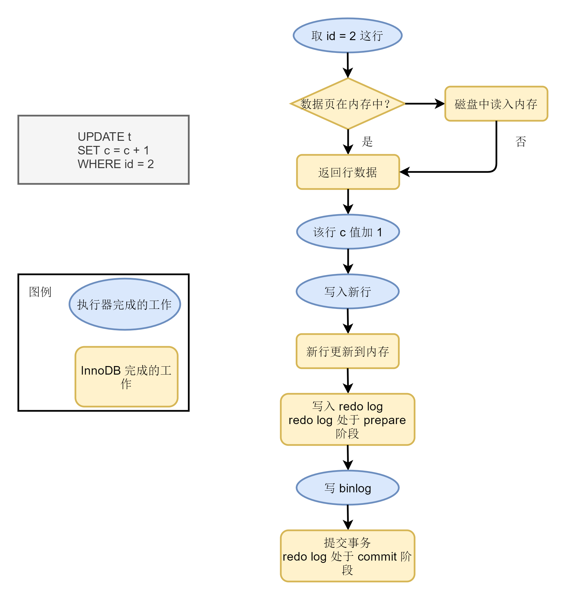

[TOC]


# 第一讲：基础架构——一条查询语句是如何执行的


> 概述：
>
> > 在本讲中，我学到了 MySQL 的基础架构（即第一节中的图）以及 MySQL 如何执行一条查询语句（结合第一节中的图，要明白 MySQL 的每个部分都做了哪些工作）


```sql
SELECT * FROM T WHERE ID = 10;
```

## 1. MySQL 的基础架构


## 2. 从基础架构图看查询语句的执行

### 2.1 连接器

1. 连接到 MySQL 服务器

   * 如果通过了，则：
     * 确定用户
     * 获知用户权限

2. 保持连接

   （无操作情况下，默认连接时长为 8 h）

### 2.2 查询缓存

建立连接后，执行语句前，先要 **查询缓存** 。

MySQL 拿到一个查询请求不是先去执行它，而是先去缓存查看是否有该语句的执行结果——如果命中，则直接返回。

缓存以 map 的形式保存：键为语句，值为执行的结果。

如果表发生了更新，则与这个表相关联的缓存会被清空。

MySQL 8 已经去除了该功能。

### 2.3 分析器

如果没有命中缓存，则执行。

1. 词法分析

   分析语句中，每个词的含义——识别每个字符串、代表含义

2. 语法分析

   根据词法分析的结果，结合语法规则，判断 SQL 语句是否符合 SQL 语法

### 2.4 优化器

- 在表中存在多个索引时，决定使用那个索引
- 在多表连接时，决定表的连接顺序

### 2.5 执行器

MySQL 通过分析器知晓你要干啥，通过优化器知晓如何做，那么接下来就要执行了。

在执行前，会对当前操作用户进行一个权限认证（查询缓存时也会如此）。

有权限就开始打开表，执行器根据表的引擎定义，使用这个引擎提供的接口：无论是否有索引，会遍历地进行 ID 值的匹配，如果匹配到，则存在结果集中。遍历完成后，将结果集返回给用户。


# 第二讲：日志系统：一条 SQL 更新语句是如何执行的？

一条查询语句走的流程，更新语句也会走一遍：执行更新语句前连接数据库。完成连接后，分析器分析语句；优化器根据分析结果告知执行器如何执行；执行器调用引擎的相关接口，完成语句的更新。

在完成语句的更新后，会把执行结果存入 **日志** 。

## 1. 日志模块

在 MySQL 中，有两个重要的日志系统：

* redo log

  redo log 属于存储引擎 InnoDB，不是 MySQL 原生的。

* binlog

  binlog 属于 Server 层

  binlog 不能进行 crash—safe，只能归档

### 1.1 redo log

一条语句更新时，InnoDB  引擎先把结果写到 redo log 中，并刷新内存，此时更新算完成了。InnoDB 在<span style="text-decoration:underline;">适当地时候</span>会把这个操作记录更新到磁盘。

其实这在 MySQL 中被称为 **WAL（Write-Ahead Logging）** 技术——即先写日志，再写磁盘。

#### 1.1.1 redo log 的“更新”

InnoDB 的 redo log 是固定大小的。


对图片的说明：

（1）、为 redo log 配置了一组文件——每个文件 1 G，共 4 个

（2）、以循环写入的方式更新 redo log：write pos 是当前记录位置，边写边后移；check point 是要擦除的位置，循环后移。

就算数据库发生异常的重启，我们也不怕——提交的纪录保存在 redo log 中，并未丢失，可以恢复。这个能力成为 **crash—safe** 。

### 1.2 redo log 与 binlog 的不同

1. 处于的层级不同

2. redo log 是物理日志——记录哪个数据页做了什么修改；

   binlog 是逻辑日志——记录更新语句的原逻辑（就是更新语句）

3. 写的方式不同：

   - redo log 是循环写，空间固定（正如 1.1.1 中所说）
   - binlog 是“追加写”

### 1.3 细看更新流程



#### 1.3.1 数据库的“还原”

binlog 中存放的是更新逻辑，而数据库是会每隔一段时间做整库备份的。如果，某天数据崩溃，可以找到最近的一次备份，按照 binlog 把它恢复过来。

#### 1.3.2 redo log 为何做两次写入？

为了保证数据的一致性。

# 第三讲：事务隔离：为什么你改变了我看不见？

## 1. 事务的概述

### 1.1 什么是 *事务*

> 事务就是一组数据库操作要么都成功，要么都失败。

事务的支持是在存储引擎层实现的。

### 1.2 多个事务同时执行时，可能出现的问题

- 脏读

  一个事务读到其他事务 **update** 后未提交的数据

- 不可重复读

  一个事务读到其他事务 **update** 或 **delete** 后已提交的数据

- 幻读

  一个事务读到其他事务 **insert** 后已提交的数据

因此，为了解决这些问题，提出了 **隔离级别** 的概念。隔离得越严实，效率也就越低。

## 2. 事务的隔离级别

### 2.1 SQL 标准的事务隔离级别

- 读未提交（read uncommitted）

  一个事务没提交时，它做的变更能被其他事务看到

- 读已提交（read committed）

  一个事务提交后，它做的变更才能被其他事务看到

- 可重复读（repeatable read）

  一个事务执行过程中看到的数据，与它刚启动时看到的数据是一致的

- 串行化（serializable）

  对于同一行记录，“写”会加“写锁”，“读”会加“读锁”。读写锁冲突时，必须等这个事务完成后，其他事务才能操作

#### 2.1.1 举个例子，理解事务隔离级别

```sql
CREATE TABLE t (c INT) ENGINE = InnoDB;
INSERT INTO t (c) VALUES (1);
```


在不同的事务隔离级别下，分析下 V1、V2、V3 的值

### 2.2 InnoDB 是这样实现事务的

* 可重复读

  在事务开始时，直接建一个视图；在执行过程中，读视图中的数据

* 读已提交

  在 SQL 语句开始执行时，创建一个视图

* 读未提交

  直接读取返回记录上的最新值

* 串行化

  通过加锁的方式，避免并行访问

## 2.3 事务隔离的实现

以 ”可重复读“  为例：

每条记录在更新时都会记录一条回滚记录。记录上的最新值，通过回滚可以得到前一个状态值。

回滚记录的版本可能会有多个。


# 第四讲：深入浅出索引（上）

## 1. 索引概述

- 索引出现目的是为了提高数据查询的效率
- 索引的实现在存储引擎层

## 2. 索引的常见类型

数据库的索引可以用多种数据结构实现：哈希表、有序数组、树

|          | 数据结构简介                                                 | 适用情况                                          | 分析                                                         |
| -------- | ------------------------------------------------------------ | ------------------------------------------------- | ------------------------------------------------------------ |
| 哈希表   | 用一个哈希函数把 key 映射到数组的某一个位置上，把 value 放到这个位置；如果一个位置被多次映射到，则拉出一个链表 | 哈希表适用于等值查询的场景，比如一些 NoSQL 的引擎 |                                                              |
| 有序数组 | ~~~~                                                         | 有序数组适用于静态存储引擎                        | 单看查询效率，有序数组在等值查询和范围查询上是很优秀的；但如果更新数组向中间插入一个元素时，要挪动后面的所有记录 |
| 搜索树   | 二叉搜索树：父节点大于左孩子，小于右孩子。其中二叉搜索树的搜索时间复杂度为 O(log(n))，维持二叉搜索树的时间复杂度为 O(log(n)) | InnoDB 使用 B+ 树作为索引                         | 索引不止存在内存中，还要写到磁盘。虽然二叉搜索树的搜索效率高，但需要很多次读写磁盘；因此，InnoDB 使用 B+ 树减少磁盘读写次数 |

> 数据库底层存储的核心是基于常见的数据结构的。碰到一个新数据库时，关注它的数据模型，就能分析出它的适用场景。

## 3. InnoDB 的索引模型

- 在 InnoDB 中，表都是按主键顺序以索引形式存放的；InnoDB 使用 B+ 树索引，所以数据存储在 B+ 树中

- 每一个索引在 InnoDB 里对应一棵 B+ 树

- 索引类型：

  - 主键索引

    主键索引的叶节点存的是整行数据

  - 非主键索引

    非主键索引的叶节点存的是主键的值

  - 主键索引与非主键索引的区别：

    查询语句使用主键索引时，直接拿到数据；

    查询语句使用非主键索引时，要 “**回表**”

- 业务字段做主键的情况：

  - 只有一个索引
  - 该索引必须为唯一索引


# 第五讲：深入浅出索引（下）

## 1. 回表

数据库中有一张表。这张表有一个主键索引与一个非主键索引。现在查询语句的条件是根据非主键索引查询内容。做法是：

> 先在非主键索引树中找到该条记录对应的主键
>
> 再回到主键索引树中根据对应的主键查询到要找的内容

这个过程称为 **“ 回表 ”**。

## 2. 覆盖索引

注意前面学到的知识：主键树与非主键树对应的内容

### 2.1 概念

现在查询语句的条件是根据非主键索引查询主键。做法是：

>先在非主键索引树中找到该非主键索引对应的主键
>
>然后返回主键

这样避免了 **“ 回表 ”** 操作。也就是说，在这个查询里，非主键索引 “ 覆盖 ” 了查询需求，我们称为 **“ 覆盖索引 ”**。

#### 2.1.1 覆盖索引的优缺点

> 使用覆盖索引减少了树的搜索次数，提高查询性能 —— 覆盖索引优化性能的手段

> 索引字段的维护是有代价的。
>
> 建立冗余索引支持覆盖索引时需要权衡。

##  3. 最左前缀原则

原理：

> InnoDB 使用 B+ 树的索引结构
>
> 可以利用索引的 **” 最左前缀 “**，快速定位记录


## 4. 建立联合索引时，如何安排索引内字段顺序 ？

1. 第一原则：

   通过调整顺序，可以少维护一个索引，那么这个顺序优先考虑。

   （考虑最左前缀原则）

2. 第二原则：

   空间

   

# 第六讲：全局锁和表锁：给表加个字段怎么有这么多阻碍

> 数据库所设计的初衷是 **处理并发问题** 。
>
> 作为多用户共享的资源，当出现并发访问时，数据库要合理地控制资源的访问规则。
>
> 而锁就是访问规则中重要的数据结构。
>
>  
>
> 数据库有三种分类：
>
> * 全局锁
> * 表级锁
> * 行锁

## 6.1 全局锁

> 全局锁就是对整个数据库实例加锁。

### 6.1.1 加全局锁的方式

```mysql
Flush tables with read lock
```

简称为 ***FTWRL***

- 使用这个命令，整个库将处于只读状态
- 其他线程的下列语句被阻塞：
  - 数据库更新语句（数据的增删改）
  - 数据定义语句（建表、修改表结构）
  - 更新类事务的提交语句

### 6.1.2 全局锁的使用

#### 6.1.2.1 使用场景

> 做全库逻辑备份时使用

但是这样做是很 ***危险的（分别从主库与从库的角度看）***。

如果备份不加锁，备份系统得到的库又不处于同一个逻辑时间点——视图的逻辑是不一致的。


##### 6.1.2.1.1 采用事务做全库备份

**因此推荐：备份时，在可重复读隔离级别下开启一个事务，进行备份。**

MySQL 自带的逻辑备份工具是：```mysqldump```

处理逻辑：`mysqldump` 使用参数 `-single-transaction` 时，导出数据前，会开启一个事务，确保拿到一致性视图。


但是如果库中的表不支持事务时，还是要是第一种方式的。


##### 6.1.2.1.2 另一种全库只读方式

> 使用 `set global readonly = true` 也能使整个库处于只读状态。

但是更推荐使用第一种方式。

原因：

1. 在有些系统中，`readonly` 的值被用来做其他逻辑
2. 异常处理上有差异：
   - 执行 `FTWRL`  命令出现异常后、与客户端断开后，MySQL 会自动释放全局锁
   - 将整个库设为 `readonly=true` 时，客户端发生异常后，整个库将一直处于只读状态 


## 6.2 表级锁

> MySQL 的表级锁有两种：
>
> 1. 表锁
> 2. 元数据锁（meta data lock）

### 6.2.1 表锁

#### 6.2.1.1 表锁的使用

> 通过 `lock tables ... read / write` 为一个表加锁；
>
> 通过 `unlock tables` 或者与客户端断开时释放锁

表加锁后，本线程与其它线程的读写均会受到影响。

### 6.2.2 元数据锁（MDL）

> MDL 不需要显示使用，在访问一个表时会被自动加上。
>
> MDL 的作用：保证数据读写的正确性。

#### 6.2.2.1 MDL 的读写锁：

> 1. 对一个表做增删改查操作时，加 MDL 读锁；
> 2. 对一个表结构变更时，加 MDL 写锁

##### 6.2.2.1.1 MDL 读写锁的互斥性

- 读锁之间不互斥：可以有多个线程同一个表增删改查；
- 读写锁、写锁之间互斥，这样是为了保证表结构操作的安全性。

##### 6.2.2.1.2 MDL 读写锁的释放

> 事务中的 MDL 锁，在语句执行时 **申请** ，语句结束后并不会马上释放，
>
> 而是再事务提交后 **释放** 。

#### 6.2.2.2 如何安全地给小锁加字段？

先解决长事务（事务不提交，就一直占用 MDL 锁）。

建议：

- MySQL 的 `information_schema 库` 的 `innodb_trx 表` 存放当前执行的事务
- 做 DDL 变更时，正好有长事务执行，可以先暂停 DDL 或者 kill 这个长事务


如果这个表是热点表，又改如何呢？

在 `alter table` 语句中设定等待时间。

如果在这个时间内拿到 MDL 锁最好；拿不到也不会阻塞后面的业务，之后，再重试这个操作。


# 第七讲：行锁功过：怎么减少行锁对性能的影响

* MySQL 的行锁在引擎层由各个引擎实现。InnoDB 是支持行锁的，但 MySQL 自带的 MylSAM 引擎不支持行锁。
* 不支持行锁的意味着并发控制只能使用表锁 —— 这种引擎的表任意时刻只能有一个更新在执行，严重影响业务并发度。


- 行锁就是针对数据表中的行的锁 —— 一个表的同一行任意时刻只允许一个更新进行。

##   7.1 两阶段锁

> 两阶段锁协议：InnoDB 事务中，行锁是在需要的时候才加上的；释放就要等到事务提交结束时了。

**根据两阶段锁的建议：**

如果事务要锁多个行，把有可能造成所锁冲突、影响并发度的锁尽量往后放。


第八讲：事务到底是隔离还是不隔离

