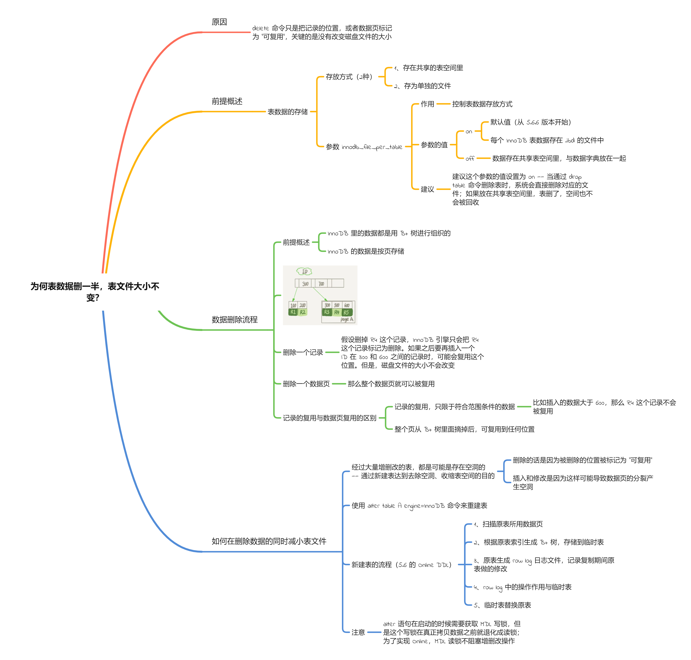
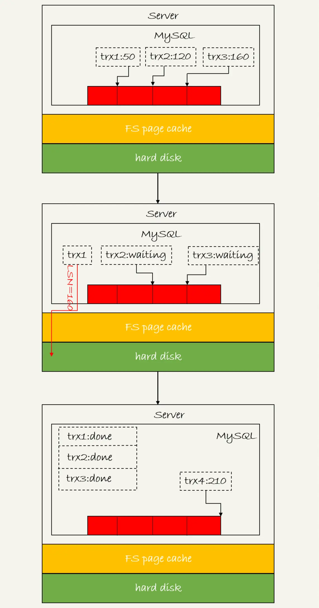

[TOC]

# 11、怎么给字符串字段加索引？

在前面一张中已经学到了字符串字段的 ***最左前缀匹配规则***  。那么我们就跟这个规则字符串建立索引。

#### 0.0.0.1 为什么要加要给字符串字段加索引？

首先要明白：如果不给某个常用的字符串字段建索引，那个相关语句在根据它进行操作时会进行全表扫描（本节课开头局的例子）。

## 11.1 最左前缀规则加索引

> 最左字段加索引：可以定义字符串的最左的几个字段作为索引
>
> 默认加索引：默认地，字符串索引做索引不指定长度，索引默认包含整个字符串。

### 11.1.1 注意：

> > 使用前缀索引，定义好长度 —— 既节省空间，用避免额外的查询

- 节省空间

  相比较 “默认加索引” 而言，使用具有高区分度的最前面的几个字符作为索引，能节省空间（索引选取的越长，占用的磁盘空间就越大，相同的数据页能放下的索引值就越少，搜索的效率也就会越低）

- 避免额外的查询

  找出最前面的字符中最具区分度的长度，避免在使用索引树过程中的重复查询

  

**特别说明： **

> 在建立索引时关注的是区分度，区分度越高越好。因为区分度越高，意味着重复的键值越少

### 11.1.2 前缀索引对覆盖索引的影响 

使用前缀索引就用不上覆盖索引对查询性能的优化了，这也是在选择是否使用前缀索引时需要考虑的一个因素

# 12、为什么我的 MySQL会“抖”一下？

> 情景导入：
>
> 一条 SQL 语句平常执行很快，偶尔某次会变得很慢。这种场景又难以复现。

## 12.1 概述

### 12.1.1 WAL 

在第二篇文章里（日志系统：一条 SQL 更新语句是如何执行的）我们了解了 ***WAL （Write-Ahead Logging） 机制*** ：先写日志（redo log），再写磁盘。

### 12.1.2 名词了解

- **flush**

  把内存里的数据写入磁盘的过程

- **脏页**

  内存数据页与磁盘数据页内容不一致，称这个内存页为 **脏页**

- **干净页**

  内存数据写入磁盘后，内存数据与磁盘数据一致，称为 **干净页**

“抖的”那一下很大程度上是由于 MySQL 从 redo log 向磁盘写数据 —— MySQL 在刷新脏页。

## 12.2 MySQL 何时进行 flush？

1. InnoDB 的 redo log 写满，系统停止所有的更新操作
2. 系统内存不足 —— 需要新内存页时，内存不够，淘汰一些数据页，留出内存给其它数据页使用
3. MySQL 认为系统 “空闲”时，MySQL 把内存中的脏页 flush 到磁盘
4. MySQL 正常关闭时，MySQL 把内存中的脏页 flush 到磁盘

### 12.2.1 四种场景对性能的影响

- 第三种与第四种对性能的影响微乎其微
- 第一种情况 InnoDB 要尽量避免 —— 出现这种情况后，整个系统的更新被阻塞
- 第二种情况（内存不够，脏页写入磁盘）应该是常态

#### 12.2.1.1 补充

InnoDB 通过缓冲池 buffer pool 管理内存。

池中内存页有三种状态：

- 未被使用
- 使用了，为干净页
- 使用了，为脏页

# 13、为何表数据删一半，表文件大小不变？

# 14、count(*) 这么慢，我该怎么办？

# 	16、“order by”是怎么工作的？

# 18、为什么这些SQL语句逻辑相同，性能却差异巨大？

> 对索引字段做函数操作，可能会破坏索引值的有序性，因此优化器就决定放弃走树搜索功能

其中 ***函数操作***  是在 `where` 条件的 *左表达式*  使用或进行：

- MySQL 自带的函数
- `+`、`-`、`*` 等算数操作
- 进行隐式的（数据类型、字符编码等）转换

虽然优化器会放弃索引树的搜索功能，但不意味着 MySQL 不使用这个索引了 —— 可能会对这个索引进行全索引扫描。

# 19、为什么我只查一行语句，也执行这么慢？

# 23、MySQL 怎么保证数据不丢失？—— redo log 与 bin log 数据持久化到磁盘

MySQL 保证数据不丢失，跟数据可靠性相关。

前面了解到 MySQL 通过将 redo log 和 bin log 中的数据持久化到磁盘，保证在 MySQL 异常重启的情况下数据不丢失。

下面我们就学习 redo log 与 bin log 如何将数据持久化到磁盘。

## 23.1 bin log 持久化到磁盘

### 23.1.1 bin log 的写入机制

## 23.2 redo log 的写入机制

事务执行过程中，生成的 redo log 要先写入 redo log buffer 中。++++++

在事务没提交时，redo log buffer 的部分日志可能没有被持久化到磁盘。

因此，redo log 可能存在 3 种状态：

1. 存在于 redo log buffer 
2. 只 write，没有 fsync
3. 持久化到磁盘

### 23.2.1 redo log 的写入策略

InnoDB 提供 `innodb_flush_log_at_trx_commit` 参数控制写入策略：

1. `innodb_flush_log_at_trx_commit = 0`，每次事务提交 **只把**  redo log 留在 redo log buffer
2. `innodb_flush_log_at_trx_commit = 1`，每次事务提交将 redo log 持久化到磁盘
3. `innodb_flush_log_at_trx_commit = 2`，每次事务提交都 **只把**  redo log 写到 page cache

InnoDB 有一个后台进程，每隔 1 秒把 redo log buffer 中的日志先 write（写进 page cache），再 fsync（持久化到磁盘）。

***注意：***

由于 ++++++，一个没有提交的事务也可能被持久化到磁盘。

#### 23.2.1.1 两种特殊的写入情况

下面两种场景会把一个没有提交的事务的 redo log 写入到磁盘：

1. redo log buffer 占用的空间达到 `innodb_log_buffer_size` 的一半
   - 由于事务未提交，只是 write（写进 page cache）
2. 并行的事物提交，顺带把当前事务的 redo log buffer 持久化到磁盘

MySQL 的 “双1” 配置指的是 `sync_binlog = 1` 与 `innodb_flush_log_at_trx_commit = 1` 。即：一个事务未提交时进行 2 次刷盘：一次是 redo log（prepare 阶段），一次是 bin log。

## 23.3 组提交（group commit）

### 23.3.1 日志逻辑序列号（LSN，log sequence number）

- LSN 单调递增，对应 redo log 的一个个写入点
- LSN 的值会加上每次写入 redo log 的 length

- LSN 会写到 InnoDB 的数据页中，确保数据页不会被重复的 redo log

### 23.3.2 举例

三个并发事务 (trx1, trx2, trx3) 在 prepare 阶段，都写完 redo log buffer，持久化到磁盘的过程，对应的 LSN 分别是 50、120 和 160。

从图中可以看到，

1. trx1 是第一个到达的，会被选为这组的 leader；
2. 等 trx1 要开始写盘的时候，这个组里面已经有了三个事务，这时候 LSN 也变成了 160；
3. trx1 去写盘的时候，带的就是 LSN=160，因此等 trx1 返回时，所有 LSN 小于等于 160 的 redo log，都已经被持久化到磁盘；
4. 这时候 trx2 和 trx3 就可以直接返回了。

所以，一次组提交里面，组员越多，节约磁盘 IOPS 的效果越好。但如果只有单线程压测，那就只能老老实实地一个事务对应一次持久化操作了。

## 23.4 再看 redo log 与 bin log 的提交流程

。。。。。。。（见博客）

## 23.5 通过以上内容的学习，提升 MySQL 的性能

。。。。。。。（见博客）

