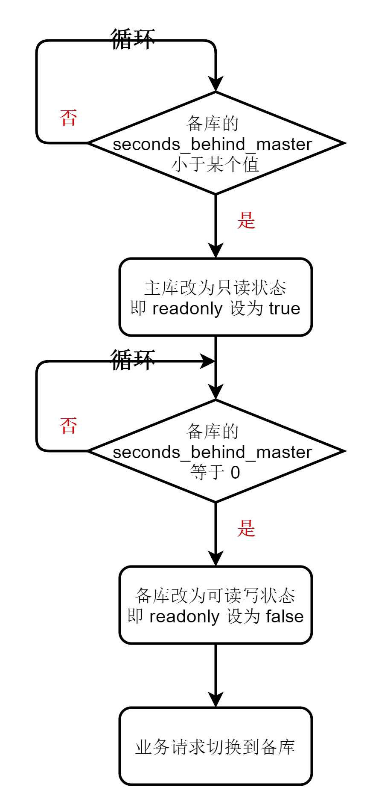

[TOC]

# 24、MySQL 是怎么保证主备一致的

## 24.1 MySQL 主备的基本原理

### 24.1.1 M — S 型主备模型

### 24.1.2 事务日志同步过程

## 24.2 bin log 的三种格式对比

- statement
  - **记录的是 sql 的逻辑语句**
  - 备库在执行主库的语句时执行结果可能不一致。
  - 原因：如果 where 条件中有多个索引，主备库在执行这条语句时，选择的索引可能不同，执行结果也就不同
- row
  - **由于记录的是修改的主键的 id**，备库执行结果与主库一致
- mixed
  - statement 可能导致主备不一致；row 遇到大事务时，log 体积很大。因此，MySQL 根据判断后自动选择是 statement 还是 row

## 24.3 用 bin log 恢复数据

> 1. 用 **mysqlbinlog** 工具解析
> 2. 把解析结果整个发给 MySQL 执行

## 24.4 M—M 结构的主备复制

### 24.4.1 解决两个节点间的循环复制的问题

- 规定两个库的 server id 必须不同
- 一个备库接到 binlog 并在重放的过程中，生成与原 binlog 的 server id 相同的新的 binlog
- 每个库在收到从自己的主库发过来的日志后，先判断 server id，如果跟自己的相同，表示这个日志是自己生成的，就直接丢弃这个日志。

# 25、MySQL 是怎么保证高可用的？

## 25.1 主备延迟

### 25.1.1 三个相关的时间点

1. 主库执行完成一个事务并写入 bin log 的时刻：T1
2. 主库传递给备库，备库接受完成 bin log 的时刻：T2
3. 备库执行完这个事务的时刻：T3

#### 25.1.1.1 主备延迟的概念

主备延迟指：同一个事务在备库执行完成的时刻与主库执行完成时刻的差值 —— 即 `T3 - T1`。

### 25.1.2 查看主备延迟的时间

> 在备库上执行 `show slave status` 命令
>
> 返回结果中的 `seconds_behind_master` 表示当前备库延迟了多少秒 

#### 25.1.2.1 `seconds_behind_master` 的计算方法

- 每个事务的 bin log 中都有一个字段记录在主库上写入时间 A
- 备库取出当前正在执行的事务的时间字段的值 B
- 计算 A、B 差值，得出 `seconds_behind_master` 的值

注意：

A、B 的值都是以主库时间为准的。

悲苦连接到主库时，获取主库的当前系统时间。如果主备库时间不一致，计算时会带上差值一起计算。

## 25.2 引起主备延迟的原因

1. 某些部署条件下，备库的机器性能比主库的机器性能差。
2. 做了对称部署，备库的压力大。
   - 比如：在备库上做大量查询，占用 CPU 时间过长，影响同步速度，造成主备延迟。
     - 解决方法：
       - 一主多从 —— 除备库外，还有多个从库
       - bin log 输出到外部系统，外部系统提供统计类查询
3. 大事务
   - 主库的事务执行完，才能写入 bin log，传给备库，备库执行。如果主库的事务是一个大事务，备库执行起来自然耗费大量时间。
4. 修改大表的 DDL

## 25.3 主备切换的策略

### 25.3.1 可靠性优先策略

### 25.3.2 可用性优先策略

可用性优先策略：备库先改为可读写状态，业务请求切换到备库。其他与可靠性操作性相同。