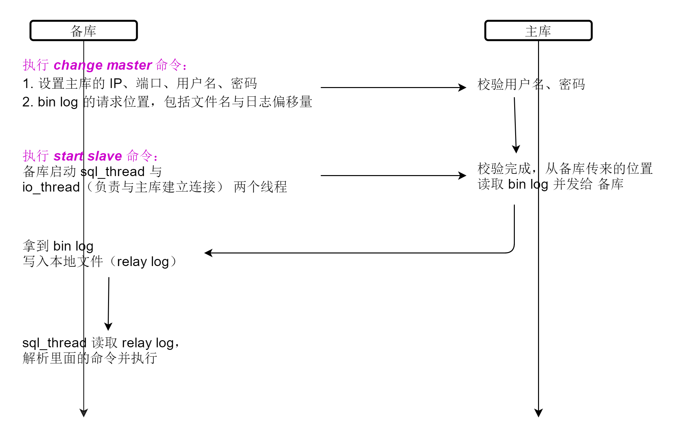

[TOC]

# 24、MySQL 是怎么保证主备一致的

## 24.1 MySQL 主备的基本原理

### 24.1.1 M — S 型主备模型

### 24.1.2 事务日志同步过程

## 24.2 bin log 的三种格式对比

- statement
  - **记录的是 sql 的逻辑语句**
  - 备库在执行主库的语句时执行结果可能不一致。
  - 原因：如果 where 条件中有多个索引，主备库在执行这条语句时，选择的索引可能不同，执行结果也就不同
- row
  - **由于记录的是修改的主键的 id**，备库执行结果与主库一致
- mixed
  - statement 可能导致主备不一致；row 遇到大事务时，log 体积很大。因此，MySQL 根据判断后自动选择是 statement 还是 row

## 24.3 用 bin log 恢复数据

> 1. 用 **mysqlbinlog** 工具解析
> 2. 把解析结果整个发给 MySQL 执行

## 24.4 M—M 结构的主备复制

### 24.4.1 解决两个节点间的循环复制的问题

- 规定两个库的 server id 必须不同
- 一个备库接到 binlog 并在重放的过程中，生成与原 binlog 的 server id 相同的新的 binlog
- 每个库在收到从自己的主库发过来的日志后，先判断 server id，如果跟自己的相同，表示这个日志是自己生成的，就直接丢弃这个日志。