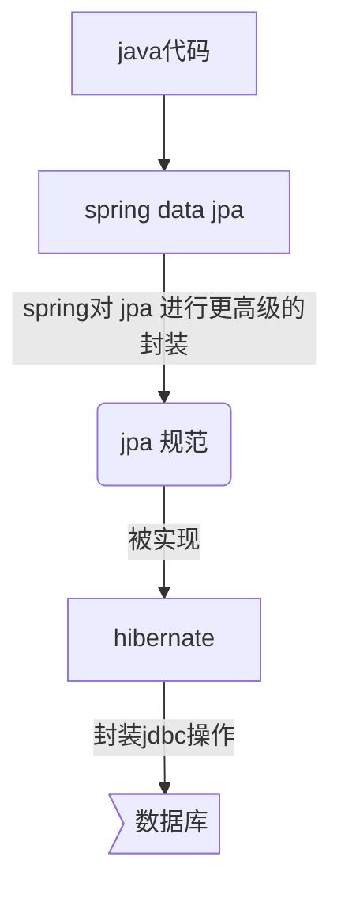

[TOC]

# 1.  特性

```spring data jpa`` 极大地简化了数据库访问层的代码：

​		```dao 层```只需编写接口，就具有了 ```CRUD```、分页查询等操作。

## 1.1  spring Data Jpa，jpa规范和hibernate之间的关系



# 2.  小实践

## 2.1  搭建环境

* 创建 ```maven``` 工程，完善 ```pom``` 文件
* 完善 ```spring``` 配置文件
* 编写实体类，使用 ```jpa``` 注解实现映射关系

* 编写 ```spring data jpa``` 的 ```dao``` 层接口

## 2.2  ```dao``` 层接口规范

* 继承接口
  * ```JpaRepository <操作的实体类类型，实体类中主键属性的类型>```
    封装了基本 ```CRUD```操作
  * ```JpaSpecificationExecutor <操作的实体类类型>```
    封装了复杂查询（分页)
* 提供响应的泛型


# 3.  ```spring data jpa``` 运行过程与原理剖析

>1.通过```JdkDynamicAopProxy```的```invoke```方法创建了一个动态代理对象
>
>2.```SimpleJpaRepository``` 当中封装了  ```JPA``` 的操作（借助JPA的api完成数据库的CRUD）
>
>3.通过hibernate完成数据库操作（封装了jdbc）

<hr>

定义的是接口，但真正发挥作用的是接口的实现类。

> 程序执行中，借助 **动态代理** 自动生成接口的实现类对象。


*我直接使用```spring boot```，一些部分可能会不同。*


# 4.  复杂查询

## 4.1  借助接口中定义好的方法查询

* findOne(id) 

  借助 id 查询

## 4.2  jpQL(jpa query language)查询

* 特点：

  语法或关键字和sql语句类似；

  **操作对象是类和类中的属性**


>需要将JPQL语句配置到接口方法上
>
>​	1.特有的查询：需要在dao接口上配置方法
>
>​	2.在新添加的方法上，使用注解的形式配置 jpQL 查询语句
>
>​	3.注解 ： ```@Query```

### 4.2.1  查询

* ```@Query```
  * ```value``` 属性指定执行的语句

**注意：**

* 对于多个占位符参数，赋值的时候，默认的情况下，占位符的位置需要和方法参数中的位置保持一致
* 指定占位符参数的位置：```?``` 索引的方式，指定此占位的取值来源

### 4.2.2  更新 / 删除

* ```@Query```

* ```@Modifying```

  表示当前执行的是一个更新 / 删除操作

  

* ```@Transaction```

* ```@Rollback(value = false)```

## 4.3  SQL 查询

1.特有的查询：需要在dao接口上配置方法

2.在新添加的方法上，使用注解的形式配置sql查询语句

3.注解 ： @Query

​         value ：jpql语句 | sql语句

​         nativeQuery ：false（使用jpql查询） | true（使用本地查询：sql查询）

​                是否使用本地查询

 注意：

​         返回的是一个 Object[]

## 4.4  方法名规则查询

对 jpQL 查询更加深入一层的封装，只需要按照 Spring Data Jpa 提供的方法名称规则定义方法，不需要再配置 jpql 语句，完成查询。

### 4.4.1  规则

1. ```findBy``` + 属性名称 （根据属性名进行匹配查询 ```=```）

2. ```findBy``` + 属性名称 + “查询方式：```Like | isnull```）”

多条件查询

```findBy``` + 属性名 + “查询方式”  + “多条件的连接符（```and|or```）” + 属性名 +“查询方式”


# 5.  Specifications 动态查询

## 5.1  方法列表

### 5.1.1  ```JpaSpecificationExecutor``` 接口的方法列表
* ```T findone (Specification<T> spec)```

  查询单个对象

* ```List<T> findAll(Specification<T> spec)```

  查询列表

* ```Page<T> findAll(Specification<T> spec，Pageable pageable)```

  查询全部，分页

  * ```pageable```:  分页参数
  * 返回值: 分页 ```pageBean``` ( ```page```:  是 ```spring data jpa``` 提供的)

* ```List<T> findAll(Specification<T> spec,sort sort)```

  查询列表

  * ```sort```:  排序参数

* ```long count (Specification<T> spec)``` 

​       统计查询

### 5.1.2  ```Specification``` 接口

```Specification``` 类表示查询条件;

自定义自己的 ```specification``` 实现类

* 实现

  * ```Predicate toPredicate(Root<T> root，criteriaQuery<?> query，CriteriaBuilder cb)```

    封装查询条件

    * ```root```: 查询的根对象（查询的任何属性都可以从根对象中获取>
    * ```CriteriaQuery```: 顶层查询对象，自定义查询方式（了解:一般不用)
    * ```CriteriaBuilder```: 查询的构造器，封装了很多的查询条件


## 5.2  自定义查询条件

1. 实现 ```Specification``` 接口（提供泛型：查询的对象类型）
2. 实现 ```toPredicate()```（构造查询条件）
3. 需要借助方法参数中的两个参数
   * ```root```：获取需要查询的对象属性
   * ```CriteriaBuilder```：构造查询条件的，内部封装了很多的查询条件（模糊匹配，精准匹配）


# 6.  多表之间的关系

## 6.1  关系

### 6.1.1  表关系

* 一对一
* 一对多
  * 主表：“一”
  * 从表：“多”
  * 外键：从表上有一列作为外键，关联主表的主键
* 多对多
  * 中间表：至少有两个字段，分别作为外键指向两张表

### 6.1.2  实体类的关系

* 包含关系
* 继承关系

## 6.2  分析步骤

1. 明确表关系
2. 确定表关系（描述 外键|中间表）
3. 编写实体类，再在实体类中描述表关系
4. 配置映射关系

## 6.3  一对多配置

需要分别配置一对多的关系与多对一的关系

* 配置—对多关系

1. 声明关系
   ```@OneToMany```：配置—对多关系
   * ```targetEntity```：对方对象的字节码对象

2. 配置外键（中间表)
   ```@JoinColumn```：配置外键
   * ```name```：外键字段名称
   * ```referencedColumnName```：参照的主表的主键字段名称

* 配置多对—关系

  1. 声明关系

     ```@ManyTo0ne```：配置多对一关系

     * ```targetEntity```：对方的实体类字节码

  2. 配置外键（中间表)

     与 *一对多* 的配置相同

### 6.3.1  设置级联

删除主表数据，从表数据也被删除

## 6.4  多对多

略