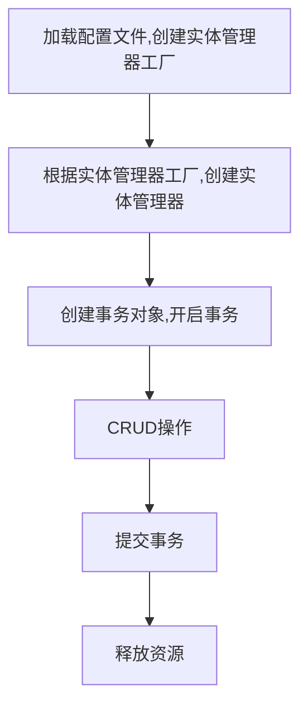

[TOC]

创建一个简单的 maven 项目练习 jpa

我的目的是学习相关注解

# 1.  项目准备

* 创建 maven 工程
* 导入 pom.xml 依赖
* 编写 jpa 需要的 xml 配置文件
  * ```create``` 程序运行时创建表。如果表已存在，先删除再创建
  * ```update``` 程序运行时创建表。如果表已存在，不再创建
  * ```none``` 不会创建表

# 2.  代码

## 2.1  配置实体映射表

### 2.1.1  实体类与表的映射关系（注解）

* ```@Enity``` 

  声明实体类

* ```@Table```

  配置实体类与表的映射关系

  * ```name``` 属性配置表的名称

### 2.1.2  实体类中属性和表中字段的映射关系（注解）

* ```Id```

  声明主键配置

* ```GeneratedValue```

  配置主键的生成策略

  * ```strategy ``` 配置主键生成策略

    * ```GenerationType.INEDTITY``` 自增，mysql（推荐）

      底层数据库支持自动增长

    * ```GenerationType.SEQUENCE``` 序列，oracle（推荐）

      底层数据库支持序列

    * ```GenerationType.TABLE```

      jpa 提供的一种机制，通过一张数据库表完成主键自增

    * ```GenerationType.AUTO```

      程序自动选择主键生成策略

* ```Column```

  配置属性和字段的映射关系

  * ```name``` 属性配置表中字段名称
  * ```unique```：是否唯一 
  * ```nullable```：是否可以为空 
  * ```inserttable```：是否可以插入 
  * ```updateable```：是否可以更新 
  * ``columnDefinition``: 定义建表时创建此列的DDL 
  * ```secondaryTable```: 从表名。如果此列不建在主表上（默认建在主表），该属性定义该列所在从表的名字搭建开发环境[重点]


# 3.  ```jpa	``` 的操作步骤



​         1.加载配置文件创建实体管理器工厂

​             Persisitence：静态方法（根据持久化单元名称创建实体管理器工厂）

​                  createEntityMnagerFactory（持久化单元名称）

​             作用：创建实体管理器工厂

​         2.根据实体管理器工厂，创建实体管理器

​             EntityManagerFactory ：获取EntityManager对象

​             方法：createEntityManager

​             \* 内部维护的很多的内容

​                  内部维护了数据库信息，

​                  维护了缓存信息

​                  维护了所有的实体管理器对象

​                  再创建EntityManagerFactory的过程中会根据配置创建数据库表

​             \* EntityManagerFactory的创建过程比较浪费资源

​             特点：线程安全的对象

​                  多个线程访问同一个EntityManagerFactory不会有线程安全问题

​             \* 如何解决EntityManagerFactory的创建过程浪费资源（耗时）的问题？

​             思路：创建一个公共的EntityManagerFactory的对象

​             \* 静态代码块的形式创建EntityManagerFactory

​         3.创建事务对象，开启事务

​             EntityManager对象：实体类管理器

​                  beginTransaction : 创建事务对象

​                  presist ： 保存

​                  merge ： 更新

​                  remove ： 删除

​                  find/getRefrence ： 根据id查询

​             Transaction 对象 ： 事务

​                  begin：开启事务

​                  commit：提交事务

​                  rollback：回滚

​         4.增删改查操作

​         5.提交事务

​         6.释放资源

# 4.  通过 ```jpa``` 获取数据库中的数据

* ```find()``` 方法

  立即加载

* ```getReference()``` 方法

  延迟加载；使用的较多


# 5.  通过 ```jpa``` 删除、修改数据库中的数据

略

详情查看第一天的文档