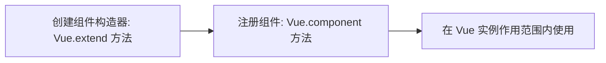

[TOC]

# 1.  组件

## 1.1  注册组件的步骤



```html
<div id="app">
    <!--3.使用组件-->
    <my-cpn></my-cpn>
</div>

<script src="./js/vue.min.js"></script>
<script>
    // 1.创建组件构造器对象
    const cpnC = Vue.extend({
        template: `
            <div>
                <h2>我是标题</h2>
                <p>我是内容，哈哈哈哈哈</p>
                <p>我是内容，呵呵呵呵呵</p>
    		</div>`
    });

    // 2.注册组件
    Vue.component('my-cpn', cpnC);

    const app = new Vue({
        el: "#app",
    })
</script>
```

## 1.2   全局组件与局部组件

根据组件注册的地方的不同进行区分

### 1.2.1  全局组件

上面实例为全局组件

使用 ```Vue.component()``` 注册

### 1.2.2  局部组件

将组件构造在实例中

```javascript
// 1.创建组件构造器对象
    const cpnC = Vue.extend({
        template: `
            <div>
                <h2>我是标题</h2>
                <p>我是内容，哈哈哈哈哈</p>
                <p>我是内容，呵呵呵呵呵</p>
    		</div>`
    });

    // 2.注册（全局）组件（可在多个 Vue 实例中使用）
    // Vue.component('my-cpn', cpnC);

    const app = new Vue({
        el: "#app",
        components: {
            // 注册局部组件
            cpn: cpnC
        }
    })
```

## 1.3  父组件与子组件

```html
<div id="app">
    <my-cpn></my-cpn>
</div>

<script src="./js/vue.min.js"></script>
<script>

    // 创建子组件构造器对象
    const cpn1 = Vue.extend({
        template: `
            <div>
            	<h2>子组件， 我是标题</h2>
            </div>`
    });

    // 创建父组件构造器对象
    const cpn2 = Vue.extend({
        template: `
            <div>
                <cpn></cpn>
                <p>我是内容，哈哈哈哈哈</p>
                <p>我是内容，呵呵呵呵呵</p>
    		</div>`,
        components: {cpn: cpn1}
    });

    Vue.component('my-cpn', cpn2);

    // 根组件
    const app = new Vue({el: "#app"})
</script>
```

## 1.4  注册组件的语法糖

```html
		<div id="app">
			<my-cpn></my-cpn>
		</div>

		<script src="./js/vue.min.js"></script>
		<script>
			// 1.创建组件构造器对象
			// const cpnC = Vue.extend({template: ``});

			// 2.注册组件
			Vue.component('my-cpn', {
				template: `
					<div>
						<h2>我是标题</h2>
						<p>我是内容，哈哈哈哈哈</p>
						<p>我是内容，呵呵呵呵呵</p>
					</div>`
			});

			const app = new Vue({
				el: "#app",
			})
		</script>
```

## 1.5  组件模板分离：两种方法

* <script type="text/x-template" id="cpn"></script>

* <template id="cpn"></template>

```html
		<div id="app">
			<my-cpn></my-cpn>
		</div>

		<!--组件分离-->
		<!--第一种: type="text/x-template"-->
		<script type="text/x-template" id="cpn">
			<div>
				<h2>我是标题</h2>
				<p>我是内容，哈哈哈哈哈</p>
				<p>我是内容，呵呵呵呵呵</p>
			</div>
		</script>

		<!--组件分离-->
		<!--第二种: template 标签-->
		<template id="cpn">
			<div>
				<h2>我是标题</h2>
				<p>我是内容，哈哈哈哈哈</p>
				<p>我是内容，呵呵呵呵呵</p>
			</div>
		</template>

		<script src="./js/vue.min.js"></script>
		<script>
			// 1.创建组件构造器对象
			// const cpnC = Vue.extend({template: ``});

			// 2.注册组件
			Vue.component('my-cpn', {
				template: '#cpn' // 通过id引用
			});

			const app = new Vue({
				el: "#app",
			})
		</script>
```

## 1.6  组件中的数据

组件不能访问 Vue 实例中的数据。

（说明：子组件不能引用父组件或 Vue 实例的数据）

组件中的 ```data``` 是一个函数。

```html
		<div id="app">
			<cpn></cpn>
		</div>

		<div id="aaa">
			<cccccc></cccccc>
		</div>

		<template id="cpn">
			<div>
				<h2>{{counter}}</h2>
				<button @click="increment">+</button>
				<button @click="decrement">-</button>
			</div>
		</template>

		<script src="js/vue.js"></script>
		<script>

			Vue.component('cccccc', {
				template: '#cpn',
				data() {
					return {counter: 0};
				},
				methods: {
					increment() {this.counter++},
					decrement() {this.counter--}
				}
			});

			const aaa = new Vue({el: '#aaa'});

			const app = new Vue({
				el: '#app',
				components: {
					cpn: {
						template: '#cpn',
						data() {return {counter: 0};},
						methods: {
							increment() {this.counter++},
							decrement() {this.counter--}
						}
					}
				}
			})
		</script>
```

### 1.6.1  为何组件中的 ```data``` 是一个函数？

保证页面中使用的每个组件有一个单独的数据域（一个组件一个单独的数据域）。

## 1.7  父子组件通信

* 在开发中，往往一些数据确实需要从上层传递到下层：

  比如在一个页面中，我们从服务器请求到了很多的数据。

  其中一部分数据，并非是我们整个页面的大组件来展示的，而是需要下面的子组件进行展示。

  这个时候，并不会让子组件再次发送一个网络请求，而是直接让 **大组件(父组件)** 将数据传递给 **小组件(子组件)**。

* 如何进行父子组件间的通信呢？

  Vue官方提到

  * 通过 ```props``` 向子组件传递数据
  * 通过事件 ```emit``` 向父组件发送消息

真实的开发中，Vue 实例（把 Vue 实例当做父组件）和子组件的通信 **与** 父组件和子组件的通信过程是一样的。

### 1.7.1  父组件向子组件传值：props

使用父组件的 ```props``` 

```html
		<div id="app">
			<cpn :cmovies="movies" :cmessage="message"></cpn>
		</div>

		<template id="cpn">
			<div>
				<ul>
					<li v-for="item in cmovies">{{item}}</li>
				</ul>
				<h2>{{cmessage}}</h2>
			</div>
		</template>

		<script src="./js/vue.min.js"></script>
		<script>
			const app = new Vue({
				el: "#app",
				data: {
					message: "你好",
					movies: ['海王', '海贼王', '海尔兄弟']
				},
				components: {
					cpn: {
						template: '#cpn',
						
						// props: ['cmovies', 'cmessage'],
						props: {
							// 类型限制
							cmovies: Array,
							// 类型限制 + 默认值 + 必传限制
							cmessage: {type:String, default:'哈哈哈哈哈', required:true}
						},
						data() {return {}}
					}
				}
			})
		</script>
```


### 1.7.2  子组件向父组件传值

```html
		<div id="app">
			<cpn @btnclick="clickNum"></cpn>
			{{num}}
		</div>

		<template id="cpn">
			<div>
				<h2>{{counter}}</h2>
				<button @click="increment">+</button>
				<button @click="decrement">-</button>
			</div>
		</template>

		<script src="./js/vue.min.js"></script>
		<script>
			const cpn = {
				template: '#cpn',
				data() {
					return { counter: 0};
				},
				methods: {
					increment() {this.counter++; this.$emit("btnclick")},
					decrement() {this.counter--; this.$emit("btnclick")}
				}
			};

			const app = new Vue({
				el: "#app",
				data: {
					num: 0
				},
				components: {
					cpn
				},
				methods: {
					clickNum() {
						this.num ++;
					}
				}
			})
		</script>
```


### 1.7.3  小总结

在页面中使用子组件：```=```  右边引号中的是父组件中数据或方法

```=``` 左边是

* 父组件向子组件传值

  左边是子组件的数据，使用 ```v-bind 糖 :```

* 子组件向父组件传值

  左边是子组件方法“发射“的方法名，使用 ```v-on 糖 @```

  

# 2.  插槽 slot

使用 ```slot``` 封装的组件更具扩展性。

## 2.1  原则：抽取共性，保留不同

* 最好的方式

  将共性抽取到组件中，将不同暴露为 ```slot``

```html

        <!--slot 
            基本用法
            可以有默认值
            有多个值时，一起被使用
		-->
		<div id="app">
			<cpn :cmessage="message"><button>+</button></cpn>
			<cpn :cmessage="message"></cpn>
            <cpn :cmessage="message">
                <span>HHHHHHH</span>
                <button>+</button>
            </cpn>
		</div>

		<template id="cpn">
			<div>
				<h2>{{cmessage}}</h2>
				<slot><h2>我是默认值</h2></slot>
			</div>
		</template>

		<script src="./js/vue.min.js"></script>
		<script>

			const cpn = {
				template: '#cpn',
				props: {cmessage: String}
			};

			const app = new Vue({
				el: "#app",
				data: {message: "你好"},
				components: {cpn}
			})
		</script>
```

## 2.2  具名插槽

```html

        <!--slot 
            基本用法
            可以有默认值
            有多个值时，一起被使用
		-->
		<div id="app">
            <cpn :cmessage="message">
                <span slot="one">HHHHHHH</span>
                <button slot="two">+</button>
            </cpn>
		</div>

		<template id="cpn">
			<div>
				<h2>{{cmessage}}</h2>
				<slot name="one"><h2>我是one slot</h2></slot>
                <slot name="two"><h2>我是two slot</h2></slot>
			</div>
		</template>

		<script src="./js/vue.min.js"></script>
		<script>

			const cpn = {
				template: '#cpn',
				props: {cmessage: String}
			};

			const app = new Vue({
				el: "#app",
				data: {message: "你好"},
				components: {cpn}
			})
		</script>
```

## 2.3  作用域插槽

```html
		<div id="app">
			<cpn></cpn>
			<cpn>
				<template slot-scope="slot">
					<span>{{slot.lan.join(' - ')}}</span>
				</template>
			</cpn>
		</div>

		<template id="cpn">
			<div>
				<h2>你好</h2>
                <!--绑定的数据名（lan）可以随意定-->
				<slot :lan="languages">
					<ul><li v-for="item in languages">{{item}}</li></ul>
				</slot>
			</div>
		</template>

		<script src="./js/vue.min.js"></script>
		<script>

			const cpn = {
				template: '#cpn',
				data() {
					return {
						languages: ['Java', 'kotlin', 'Go', 'C', 'C++', 'Python']
					}
				}
			};

			const app = new Vue({
				el: "#app",
				data: {message: "你好"},
				components: {cpn}
			})
		</script>
```

# 3.  前端模块化

```AMD```

```CMD```

```ES6```

```CommonJS```

## 3.1  ES6 的 ```export``` 与 ```import```

### 3.1.1  ```export``` 的简单使用

* 导出变量

  ```javascript
  // info.js 
  export let name = 'why';
  export let age = 18;
  
  /**
   * 或采用另外一种写法
   */
  let name = 'why';
  let age = 18;
  export {name, age};
  ```

  

### 3.1.2  ```import``` 的简单使用