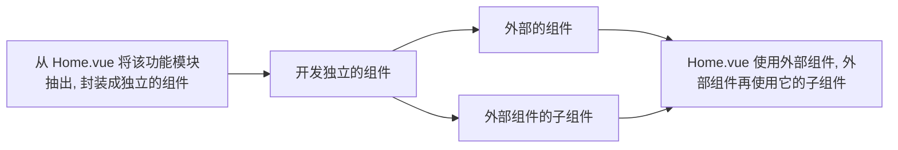

# 1.  

## 1.1  项目结构

* src

  * assets

    * css

      * base.css  ——  自己对不同的客户端进行一个适配

      * normalize.css  ——  对不同的客户端进行一个适配（github）

  * components

    * common  ——  可以在多个项目中使用的组件
    * content ——  在本项目中使用的组件

  * views  ——  具体的页面

* .editorconfig  ——  项目整体风格的配置
* vue.config.js  ——  vue 相关的配置：路径别名

## 1.2  引入“两个” css 文件

base.css

normalize.css


# 2.  tabBar

## 2.1  组件封装

* tab-bar 
* tab-bar-item

## 2.2  点击效果

### 2.2.1  页面跳转

* 具体页面在 views 中写好
  * 编写 ```vue-router```

### 2.2.2  tab-bar-item 变换

* ```:style``` + ```computed```

  

# 3.  navBar

## 3.1  封装

```html
<div class="‘位置’">
    <slot class="‘位置’"></slot>
</div>
```

```slot``` 外包裹一个 ```div``` 方便样式的处理。

## 3.2  css 编写

## 3.3  应用

根据具体的页面的需求插入相应的元素


# 4.  封装网络模块

	

 # 5.  首页轮播图

## 5.1  使用别人封装好的组件


# 6.  首页推荐

轮播图与推荐的写法思路是差不多的：

(只不过轮播图调用的是别人写好的)



