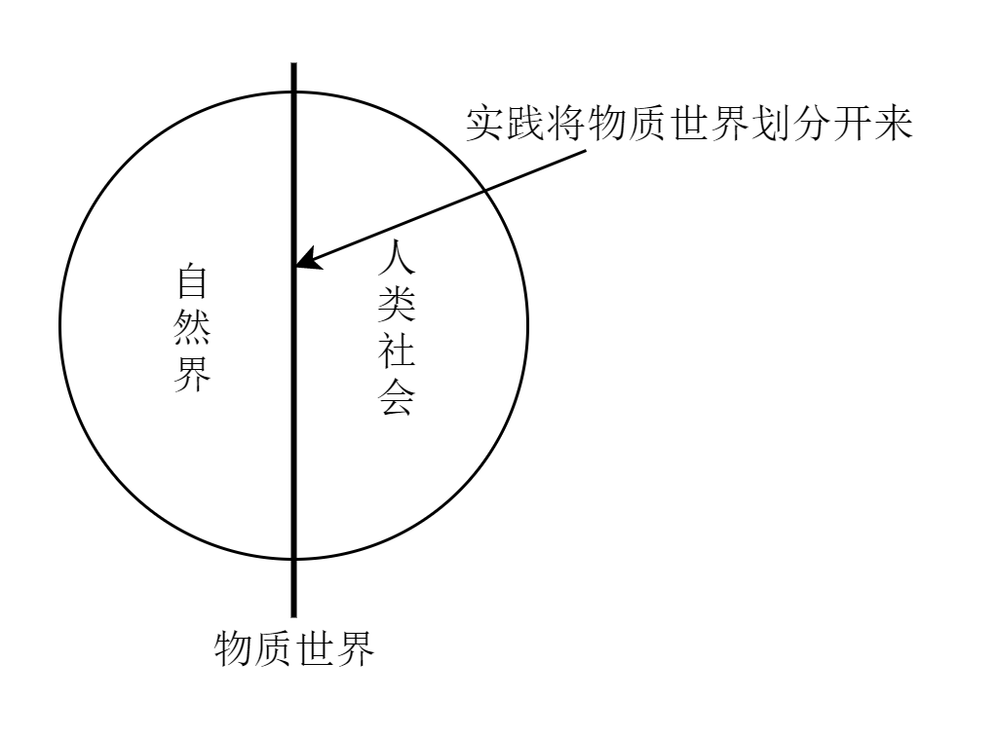
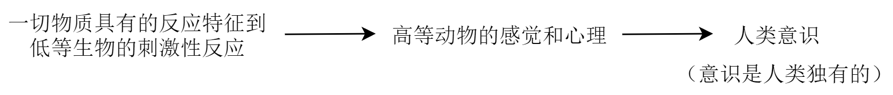
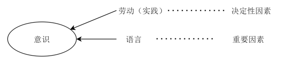

[TOC]

他们认为世界分为两极：物质与意识

物质是世界的本源
意识是物质的派生

## 1、物质观

### 1.1 物质范畴

#### 1.1.1 恩格斯的定义

> 物、物质是各种物的总和。物质便是从这一总和中    抽象    出来的

#### 1.1.2 列宁的定义

> 物质是客观标识的哲学范畴。这种客观实在是人通过感觉感知的，不依赖于人的感觉而存在，为人的感觉所复写、反应

- 列宁是通过    物质与意识    的关系定义的物质

- 物质的唯一特征

	- 客观实在

### 1.2 物质与运动

#### 1.2.1 物质的存在方式与根本属性

> **运动**

#### 1.2.2 运动的定义

- 关键词：变化

#### 1.2.3 物质与运动的关系

> 不可分割

##### 1.2.3.1 表现在

- 物质是运动着的物质
  - 脱离运动谈物质导致形而上学
- 运动是物质在运动
  - 脱离物质谈运动导致唯心主义

### 1.4 运动与静止

#### 1.4.1 运动与静止的关系

> 对立统一

##### 1.4.1.1 表现在

- 相互区别
- 相互联系

### 1.5 物质运动与时空

#### 1.5.1 时空概念

#### 1.5.2 时空与物质运动关系

> 不可分割

- 注意：

	- 时空是物质运动的存在形式

#### 1.5.3 时空的特点

- 客观性

	- 理解：时空不以人的意志转移

- 绝对性

	- 理解：时空绝对存在

- 相对性

	- 理解：速度突破极限，时空会变化

- 有限性

	- 理解：具体事务的时空是有限的

- 无限性

	- 理解：所有事物的时空是无限的

## 2、实践将物质与意识联系起来

实践是自然存在和社会存在区分和统一的基础

### 2.1 从实践出发理解社会生活的本质，把握两方面

(实践是社会生活的本质)

1. 实践是把物质世界划分为自然界和人类社会的历史前提，是自然界和人类社会统一起来的基础
2. 世界是人类社会的基础，是理解和解释一切社会现象的钥匙

- 

### 2.2 社会生活的实践主要表现在

1. 实践是社会关系形成的基础

2. 实践形成了社会生活的基本领域

3. 实践    ***构成***    社会发展的动力

   (社会基本矛盾是社会发展的动力)

## 3、意识观

### 3.1 意识的起源

#### 3.1.1 意识的概念

- 意识是自然界（物质世界）长期发展的产物
- 意识是人脑的机能和属性
- 意识是客观世界的主观映像

#### 3.1.2 意识的来源

##### 3.1.2.1 意识形成过程中的影响因素

###### 3.1.2.1.1 区分

- 语言是物质
- 语言含义是意识

### 3.2 意识的本质

- 意识是客观世界的主观映像，是客观内容和主观形式的统一

### 3.3 意识的作用

> 意识的作用：***能动作用***

#### 3.3.1 主要体现

- 1. 意识活动具有目的性和计划性
- 2. 意识活动具有创造性
- 3. 意识具有指导实践改造客观世界的作用
- 4. 意识具有调控人的行为和生理活动的作用

### 3.4 意识与物质的辩证关系

#### 3.4.1 物质与意识相互区别

- 1. 物质是本源，意识是派生
- 2. 意识不是物质，物质不是意识
- 3. 物质不能代替意识，意识不能代替物质

#### 3.4.2 物质与意识相互联系

- 1. 物质与意识能互相转化
- 2. 意识依赖于物质，又相对独立
- 3. 物质决定意识，意识反作用于物质

#### 3.4.3 正确发挥人的主观能动性

- 1. 从实际出发
- 2. 实践
- 3. 利用物质

## 4、两个名词的关系

### 4.1 不可分割

- （如果两个名词的词性不同，它们的关系是不可分割）

### 4.2 对立统一

- （如果两个名词的词性相同，它们的关系是对立统一）

