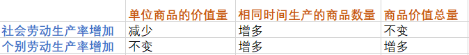
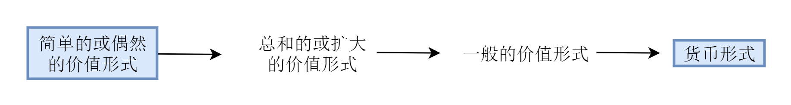
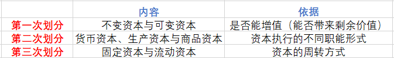

[TOC]

💛 选择知识点

🔅 表示比较重要的内容

# 政治经济学

## 1、资本主义的形成

### 1.1 资本主义产生途径

- 1. 从小商品经济中分化
- 2. 从商人与高利贷者转化

### 1.2 资本原始积累

- 1. 暴力掠夺农民土地
- 2. 暴力掠夺货币财富

最后，通过资本主义革命与产业革命，尽力资本主义发展方式

## 2、价值 💛

### 2.1 价值是什么 🔅

#### 2.1.1 商品经济

##### 2.1.1.1 概念

> 商品经济是以交换为目的进行生产的经济形式

##### 2.1.1.2 产生条件

1. 社会分工的出现
2. 生产资料和劳动产品属于不同的所有者

#### 2.1.2 商品具有使用价值和价值

##### 2.1.2.1 使用价值

###### 2.1.2.1.1 概念

> 使用价值是商品的    自然属性    ，也是一切劳动产品    共有的属性    

##### 2.1.2.2 价值

2.1.2.2.1 概念

> - （理解性总结）价值 “就是” 劳动
>
> - 价值是商品的社会属性，体现了生产者的社会关系

##### 2.1.2.3 使用价值与价值的关系

- 对立统一
  - 统一性：二者缺一不可
  - 对立性：二者不可兼得

价值是交换价值的基础，交换价值是价值的表现形式

#### 2.1.3 劳动

- 具体劳动 ——》商品的使用价值 ——》 自然属性

- 抽象劳动 ——》商品的价值 ——》 社会属性

  

### 2.2 价值的衡量 🔅

- 决定商品价值的是社会必要劳动时间，不是个别劳动时间
- 商品的价值量与社会必要劳动时间成正比，与劳动生产率成反比
- 

### 2.3 价值规律 🔅

#### 2.3.1 价值规律的内容

1. 商品的价值量由生产商品的社会必要劳动时间决定
2. 商品交换以价值量为基础，遵循等价交换原则

#### 2.3.2 价值规律的表现形式

1. 商品的价格围绕商品的价值自发波动
2. 价格受多种因素的影响
   - 供求
   - 币值
   - 价值

#### 2.3.3 价值规律的作用

### 2.4 私有制的商品经济的基本矛盾

> 私人劳动与社会劳动的矛盾构成私有制商品经济的基本矛盾

### 2.5 马克思劳动价值论

- 马克思在 ***继承*** *古典政治经济学*  劳动创造价值理论的同时，***创立***  *劳动二重性理论*
- 劳动二重性理论成为理解政治经济学的枢纽

### 2.6 价值的表现 🔅

#### 2.6.1 商品价值形式的发展

- 

#### 2.6.2 货币

货币是充当一般等价物的金、银（等贵金属）（理解这句话：金银天然不是货币，货币天然是金银）

##### 2.6.2.1 概念

> 货币是长期交换过程中固定充当一般等价物的    商品

##### 2.6.2.2 货币的职能

1. 价值尺度

   > 指货币可以衡量或表现一切商品价值的大小

   - 理解
     1. 货币是商品，具有价值，可以衡量其它商品的价值
     2. 货币也可以是 “观念上的”

2. 流通手段

   > 指货币是商品交换的媒介

   - 理解
     1. 必须是现实的货币
     2. 可以不足值

3. 贮藏手段

4. 支付手段

   > 指货币用来清除债务或支付赋税、租金、工资

5. 世界货币

###### 2.6.2.2.1  补充

1. 货币的流通时，是 “现货交易” 的；进行支付时，是 “没有现货” 的

## 3、剩余价值的生产与积累 💛

### 3.1 劳动力成为商品与货币转化为资本

#### 3.1.1 劳动力

##### 3.1.1.1 概念

> 指人的劳动能力，是人的体力和脑力的总和

##### 3.1.1.2 劳动成为商品的条件

- 1. 劳动者自由
- 2. “自由”的一无所有

##### 3.1.1.3 劳动力的价值

> 指由生产、发展、维持和延续劳动力所必需的生活必需品的价值决定

##### 3.1.1.4 劳动力的使用价值

- 劳动力的使用价值是劳动，而劳动又是普通商品的价值

当使用货币买到特殊的能够增值的商品时，货币就转化为了资本

### 3.2 剩余价值的生产

> 资本主义生产过程是    劳动过程    和    价值增殖    过程的统一

#### 3.2.1 剩余价值的计算

- 剩余价值率 = 总利润 / 购买劳动力的资金

#### 3.2.2 剩余价值的生产

##### 3.2.2.1 绝对剩余价值

- 指在必要劳动时间不变时，由于延长工作日的长度而生产的剩余价值

##### 3.2.2.2 相对剩余价值

- 指工作日长度不变，缩短必要劳动时间而相对延长剩余劳动时间生产的剩余价值

##### 3.2.2.3 超额剩余价值

- 指企业由于提高劳动生产率而使商品的个别价值低于社会价值的差额

  

##### 3.2.2.4 关于绝对剩余价值、相对剩余价值、超额剩余价值的补充

- **绝对剩余价值、相对剩余价值的比较**：
  1. 它们都 “变相” 地延长了剩余劳动时间
  2. 绝对剩余价值没有缩短必要劳动时间，而相对剩余价值缩短了必要劳动时间
  3. 绝对剩余价值没有技术进步，相对剩余价值有技术进步

- **相对剩余价值、超额剩余价值的关系**：

  要记住：“超额”是原因，“相对” 是结果（“超额”导致“相对”）

> 资本主义下的生产自动化是资本家获取超额剩余价值的手段，而雇佣工人的剩余劳动仍是这种剩余价值的唯一源泉

### 3.3 资本积累

#### 3.3.1 概念

> 指把剩余价值转化为资本，或者剩余价值资本化，就是资本积累

- 资本积累是资本主义扩大再生产的源泉
- 剩余价值是资本积累的源泉

#### 3.3.2 资本的有机构成

- 资本的技术构成

  - 指生产资料与劳动力的比例

- 资本的价值构成（c : v）

  - 指不变资本与可变资本的比例

- 资本的有机构成（c : v）

  - 由 (1) 资本的技术构成决定并 (2) 反映技术构成变化的资本价值构成

## 4、剩余价值的流转与循环 💛

### 4.1 剩余价值的循环

#### 4.1.1 产业资本的循环

- 循环有三个阶段，资本执行不同的职能

  - 1. 购买阶段 —— 货币职能
  - 2. 生产阶段 —— 生产职能
  - 3. 售卖阶段 —— 商品职能

#### 4.1.2 产业资本运动两个基本条件

- 1. 产业资本的三种职能形式空间上并存
- 2. 产业资本的三种职能形式时间上继起

#### 4.1.3 资本的周转

##### 4.1.3.1 概念

>

##### 4.1.3.2 影响因素（关键）

- 1. 资本周转时间
- 2. 生产资本中固定资本和流动资本的构成

#### 4.1.4 资本类型的划分

- 

#### 4.1.5 社会再生产的核心问题

- 即社会总生产品的价值补偿和实物补偿问题

### 4.2 剩余价值的分配

- 资本主义工资的本质：劳动力的价值或价格
- 工资表现为 “劳动的价格” 或 工人全部劳动的报酬
- 平局利润率并不阻碍超额利润的形成，因为平均利润率是行业间竞争形成的，而超额利润是行业内、企业间

### 4.3 资本主义基本矛盾

- 指生产资料私人化与生产社会化的矛盾

生产相对过剩是资本主义经济危机的本质

